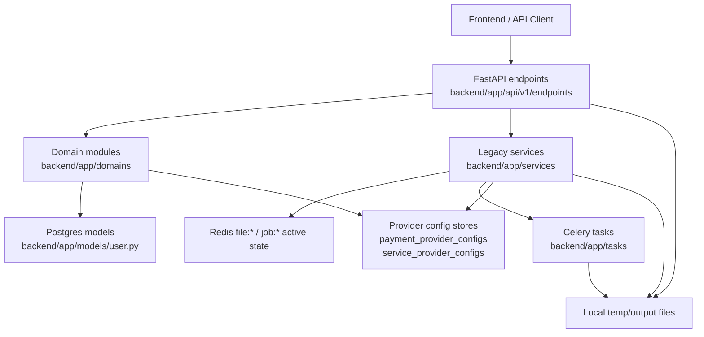
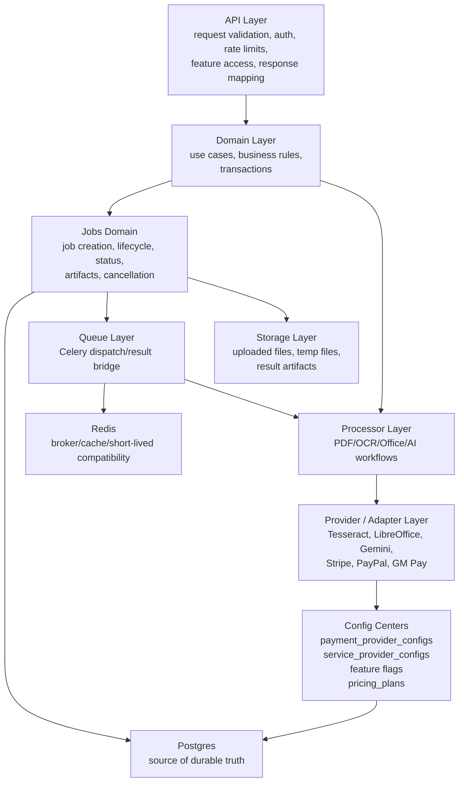

# PDF-Flow Backend Refactor Design

Status: design only, no refactor code in this phase  
Date: 2026-06-14  
Scope: backend module boundaries, job/file processing model, provider runtime boundaries

## 1. Current Structure

PDF-Flow currently has two backend styles living side by side:

- Newer domain-oriented code under `backend/app/domains/*`.
- Older service/endpoint-centered code under `backend/app/services/*` and `backend/app/api/v1/endpoints/*`.

The newer structure is strongest in payment, pricing, admin subdomains, and provider configuration. The older structure is still dominant in file processing, async jobs, advanced PDF endpoints, AI endpoints, and OCR/Office task dispatch.



### API Endpoints

- `backend/app/api/v1/endpoints/files.py` is mostly a thin API wrapper around `file_processing_service`, plus auth, rate limits, feature gates, and response mapping.
- `backend/app/api/v1/endpoints/advanced.py` performs request-level temp file handling, PDF validation, feature gates, service calls, and `FileResponse` construction inside the endpoint file.
- `backend/app/api/v1/endpoints/ai.py` repeats upload/temp-file handling for summarize, ask, extract, and batch analysis, then calls Gemini synchronously.
- `backend/app/api/v1/endpoints/admin.py` is still a large router spanning overview, operations, users, pricing, payment config, service provider config, feedback, and maintenance.

### Domains

- `backend/app/domains/payment/*` is the most mature backend domain. It owns order state, provider registry, DB-first config, env fallback, events, and provider account records.
- `backend/app/domains/pricing.py` owns the DB-first pricing catalog and fallback path.
- `backend/app/domains/service_provider/config_store.py` owns OCR, Office, and AI service provider metadata, safe config responses, encrypted secret handling, validation, and runtime config lookup.
- `backend/app/domains/files/service.py` exists, but it only wraps a small portion of file orchestration. The main file workflow still lives in `backend/app/services/file_service.py`.
- `backend/app/domains/admin/*` has begun splitting admin behavior, but admin operations still compensates for mixed Redis and DB job truth.

### Services

- `backend/app/services/file_service.py` is the central legacy file-processing service. It handles upload validation/storage, Redis file metadata, Redis job metadata, Celery dispatch, job polling, download artifact resolution, cancellation, retention cleanup, and service-provider runtime lookup.
- `backend/app/services/advanced_pdf_service.py` is mostly local PDF operation logic. It is relatively self-contained and does not need urgent rewriting.
- `backend/app/services/ai_service.py` combines Gemini provider adapter behavior, prompt/workflow behavior, DB-first config resolution, singleton caching, and fallback to `GEMINI_API_KEY`.
- `backend/app/services/feature_gate.py` centralizes feature access, but also seeds/defaults feature records in runtime-facing paths.

### Models

- `backend/app/models/user.py` contains user/auth models, API keys, usage logs, `ProcessingJob`, webhooks, payment models, provider config models, pricing plans, site content, feature flags, audit logs, feedback, and error logs in one file.
- `ProcessingJob` exists as a durable job table, but server file processing currently relies primarily on Redis `job:*` state. Admin operations merges both sources.

### Celery, Task, And Job Flow

- `backend/app/tasks/pdf_tasks.py` performs local PDF operations and returns result dictionaries. It does not persist job state to `ProcessingJob`.
- `backend/app/tasks/ocr_tasks.py` runs OCR with provider config passed in task args. `batch_ocr_task` directly calls the task function instead of cleanly composing queued jobs.
- `backend/app/tasks/office_tasks.py` repeats LibreOffice command logic across document types. `office_to_pdf_task` dispatches by directly calling other task functions.
- `backend/app/celery_worker.py` defines queues/routes, but job lifecycle ownership remains split between Celery result backend, Redis `job:*`, and the optional DB table.

### Feature Gate

- Frontend visibility and backend enforcement now share the same feature flag semantics better than before, but backend enforcement is still scattered across endpoint files.
- `is_public` controls discovery, while `enabled`, `require_login`, and `require_pro` control access. That semantic split should be preserved.

### Payment

- Payment is comparatively healthy after the payment configuration phases:
  - `payment_provider_configs` is DB-first.
  - Stripe, PayPal, and GM Pay are registry-driven in admin.
  - Env fallback remains available.
  - Secrets are write-only and encrypted.
- Remaining payment debt should not drive the next backend refactor. Payment should only receive small safety fixes until the job/file boundary is clearer.

### File, OCR, Office, And AI Processing

- Local PDF tools are split between async `/files/*` jobs and synchronous `/advanced/*` responses.
- OCR and Office use Celery, but their job state is not owned by a single durable job domain.
- AI is synchronous and endpoint-driven today. It should not be forced into the first refactor unless a request is long-running, expensive, or needs admin-visible history.

## 2. Top 5 Structure Problems

### 1. Split Job Truth Between Redis, Celery, And DB

Concrete locations:

- `backend/app/services/file_service.py`
  - Writes uploaded file metadata to Redis `file:*`.
  - Writes active job status to Redis `job:*`.
  - Polls Celery `AsyncResult` and merges it into Redis status.
- `backend/app/models/user.py`
  - Defines `ProcessingJob`, but file-processing tasks do not consistently create or update it.
- `backend/app/domains/admin/operations.py`
  - Reads Redis `job:*`, reads DB `ProcessingJob`, then merges both lists for admin visibility.

Why it hurts:

- There is no durable source of truth for processing history, ownership, cancellation, progress, output artifacts, or failure reasons.
- Admin views can show different data depending on whether Redis TTL expired.
- A completed Celery result can outlive or disappear independently from Redis and DB state.
- Adding PDF-to-Word, Compare, Translate, or larger Office/OCR flows will increase the number of places that need job lifecycle behavior.

Current impact:

- Duplicate state mapping already exists.
- Admin operations contains inference logic for job type based on status message/result shape.
- Cancellation is best-effort and not tied to a durable lifecycle transition.

### 2. `file_service.py` Is A God Service

Concrete location:

- `backend/app/services/file_service.py`

It currently owns:

- Upload validation.
- Temp directory/file storage.
- Redis file metadata.
- Redis job status.
- Celery task dispatch.
- Celery status polling.
- Download artifact resolution and zip/text packaging.
- Job cancellation.
- File retention cleanup trigger.
- Service provider runtime lookup for OCR and Office.

Why it hurts:

- Every new server-side file tool risks adding another branch to the same service.
- Testing one behavior requires faking unrelated infrastructure: Redis, Celery, filesystem, provider config, and retention.
- Provider runtime config is resolved by opening an internal DB session inside the service, which makes transaction boundaries unclear.
- The file workflow cannot be reused cleanly by advanced PDF or future document-conversion tools.

Current impact:

- The newer `backend/app/domains/files/service.py` cannot become the real boundary while `file_service.py` owns the workflow.
- Download and status behavior is tightly coupled to the exact result shape returned by Celery tasks.

### 3. Endpoint-Level Workflow Duplication

Concrete locations:

- `backend/app/api/v1/endpoints/advanced.py`
- `backend/app/api/v1/endpoints/ai.py`
- Partially `backend/app/api/v1/endpoints/files.py`

Repeated responsibilities:

- Upload validation.
- Temporary file creation.
- Cleanup.
- Feature gate calls.
- Pro checks.
- Service invocation.
- Error mapping.
- Response/file response construction.

Why it hurts:

- Adding new competitor-gap tools would copy this pattern again.
- Cleanup and response behavior can drift between endpoints.
- It is difficult to decide which endpoint should be sync, async, job-backed, or direct download because the workflow decision sits inside route handlers.
- Large endpoint files are hard to test without full FastAPI integration tests.

Current impact:

- `advanced.py` and `ai.py` already contain many similar blocks.
- AI endpoints perform real work synchronously and have their own upload/temp cleanup path.

### 4. Provider/Adapter Boundaries Are Uneven

Concrete locations:

- `backend/app/domains/payment/config_store.py`
- `backend/app/domains/payment/providers.py`
- `backend/app/domains/service_provider/config_store.py`
- `backend/app/services/file_service.py`
- `backend/app/services/ai_service.py`
- `backend/app/tasks/ocr_tasks.py`
- `backend/app/tasks/office_tasks.py`

What is good:

- Payment and service-provider config stores now have metadata-driven admin fields, encrypted secrets, safe API responses, DB-first runtime config, readiness, and fallback.

What is uneven:

- Payment provider adapters are all in one large `providers.py` file, including active providers and deprecated compatibility providers.
- OCR and Office runtime config is fetched from inside `file_service.py`, then passed into Celery args.
- Gemini service resolves provider config and also owns prompt/workflow behavior.
- Task modules contain provider execution details directly.

Why it hurts:

- Admin config, provider readiness, and runtime execution are still not fully decoupled.
- Adding a second OCR, Office, or AI provider later would either bloat task files or create more conditional branches.
- It is hard to validate provider behavior without invoking workflow code.

Current impact:

- Service-provider configuration is good enough administratively, but runtime usage still leaks across layers.

### 5. Domain And Model Ownership Is Still Blurry

Concrete locations:

- `backend/app/models/user.py`
- `backend/app/services/*`
- `backend/app/domains/*`
- `backend/app/api/v1/endpoints/admin.py`

Why it hurts:

- One model file contains unrelated concerns: auth, jobs, payment, config, pricing, content, audit, feedback, and error logs.
- Some business logic lives in `domains`, some in `services`, and some in endpoint files.
- Admin backend routing is still broad even though frontend admin information architecture has improved.
- New contributors or future agents cannot reliably infer where a new feature should live.

Current impact:

- Refactors require broad imports from `app.models.user`.
- Tests are forced to import broad modules even when they only need one bounded model set.
- Boundaries are clearer in payment than files, which creates inconsistent patterns across the codebase.

## 3. Target Architecture

The target is not a rewrite. It is an incremental boundary cleanup that keeps public APIs stable while moving ownership into small backend domains.



### API Layer

API endpoints should only own:

- Route shape.
- Request parsing and validation.
- Auth/current user dependencies.
- Rate-limit dependencies.
- Feature access calls.
- Response schema mapping.
- HTTP error translation where domain errors need API-specific status codes.

API endpoints should not own:

- Temporary file lifecycle.
- Provider selection.
- Job persistence.
- Celery result interpretation.
- Business workflow branching.

### Domain Layer

Domain modules should own:

- Use-case orchestration.
- Transaction boundaries.
- Permission-sensitive business rules after authentication is known.
- Durable state transitions.
- Integration between jobs, files, pricing, provider config, and user entitlements.

Suggested domains:

- `domains/jobs`
- `domains/files`
- `domains/pdf`
- `domains/service_provider`
- `domains/payment`
- `domains/pricing`
- `domains/admin`
- `domains/account`
- `domains/auth`

### Jobs Domain

Server-side processing should gradually move to one job abstraction:

- `job_id`
- `user_id`
- `job_type`
- `status`
- `progress`
- `input_artifacts`
- `result_artifacts`
- `result_data`
- `error_code`
- `error_message`
- `created_at`
- `started_at`
- `completed_at`
- `cancelled_at`

DB should become the durable source of truth. Redis and Celery should remain execution infrastructure and compatibility/cache during migration.

### File Upload, Task Creation, Status, And Download

These should share a unified backend job model when the operation is server-executed:

- Upload registers file/artifact metadata.
- Job creation creates a durable job row before queue dispatch.
- Status polling reads durable job state, with Redis/Celery fallback during transition.
- Download resolves a result artifact owned by the job.
- Cancellation updates durable state and revokes Celery best-effort.

Do not force browser-only frontend tools into the backend job model. Only server/API processing needs backend jobs.

### Should OCR, Office, AI, And Local PDF Tools Share A Job Abstraction?

Yes for server-powered work:

- Local PDF API tools: yes, when executed on backend/Celery.
- OCR: yes, because it is CPU-heavy and provider-dependent.
- Office conversion: yes, because LibreOffice is slow, stateful, and deployment-sensitive.
- AI: yes only for long-running or history-worthy flows. Existing synchronous AI endpoints can remain sync until there is a clear need to queue them.
- Advanced direct-download PDF endpoints: not all at once. Keep short sync operations stable first; migrate only those that become long-running or need durable history.

### Processor / Provider / Adapter Layer

Processor modules should express the workflow:

- Merge PDFs.
- Split PDF.
- OCR PDF.
- Office to PDF.
- Ask/summarize PDF.

Provider adapters should express an external or runtime capability:

- Tesseract adapter.
- LibreOffice adapter.
- Gemini adapter.
- Stripe/PayPal/GM Pay adapters.

Processors can depend on provider interfaces, not on admin config stores directly.

### Configuration Center And Runtime Decoupling

Admin config stores should remain the source for editable configuration:

- `payment_provider_configs`
- `service_provider_configs`
- `pricing_plans`
- feature flags

Runtime code should not query these tables directly from arbitrary services. Instead:

- Domain/service layer receives a DB session from the request/job boundary.
- A resolver builds typed runtime config.
- Provider adapters receive typed config.
- Workflows do not know whether config came from DB, env fallback, or defaults.

Example boundary:

```text
Admin UI/API -> config_store -> DB row + encrypted secret
Runtime workflow -> provider_resolver -> typed runtime config -> adapter
```

### What Should Stay Mostly As-Is For Now

- Payment order state machine should stay stable. It is already the healthiest domain.
- Stripe/PayPal/GM Pay checkout behavior should not be refactored during the job/file phases.
- Feature flag semantics should stay stable: `is_public` for discovery, `enabled` for ability, `require_login` and `require_pro` for access.
- Short synchronous advanced PDF endpoints can remain sync until the job foundation is stable.
- Admin frontend IA should not be expanded in this backend refactor phase.
- Existing public API paths and response shapes should remain compatible during R1/R2.

## 4. Phased Refactor Route

### Phase R1: Job Foundation Without Public API Changes

Goal:

Create a durable jobs boundary while keeping existing endpoints, Celery tasks, Redis compatibility, and frontend behavior intact.

Work:

- Add a `domains/jobs` module with a small job service/repository boundary.
- Use existing `ProcessingJob` if it is sufficient for R1; avoid schema expansion unless absolutely required.
- Start writing DB job rows for `/files/*` async jobs at creation time.
- Keep Redis `job:*` writes during the transition so old status/download paths continue to work.
- Add a read path that prefers DB job state when present and falls back to Redis/Celery for legacy jobs.
- Normalize status transitions: `pending`, `processing`, `completed`, `failed`, `cancelled`.
- Add an artifact metadata convention for result paths without redesigning storage yet.
- Keep current URLs and response shapes stable.

Risk:

- Status polling could regress if DB and Redis disagree.
- Download resolution could break if result metadata shape is mishandled.
- Cancellation could become inconsistent if durable status and Celery revoke drift.

Acceptance:

- Existing upload, merge, split, compress, rotate, image-to-PDF, PDF-to-image, OCR, Office status/download/cancel flows still work.
- Admin operations can display DB-backed jobs for new `/files/*` work.
- Existing Redis-only jobs from before deployment still show through fallback until TTL expiry.
- OCR and Office smoke tests pass.
- No payment, pricing, provider config, or frontend route behavior changes.

Rollback:

- Keep legacy Redis status path available behind the same endpoint.
- If DB job reads fail, switch status/admin reads back to Redis-first.
- Because public APIs remain unchanged, rollback is deploy-only: revert the R1 commit and keep old Redis behavior.

### Phase R2: Split `file_service.py` Into Focused Boundaries

Goal:

Reduce the god service without changing user-visible behavior.

Work:

- Extract upload/file-reference handling into a file storage or file repository component.
- Extract job dispatch into a dispatcher that knows Celery task names and queues.
- Extract result artifact resolution into a download/artifact resolver.
- Move OCR/Office runtime config resolution out of `file_service.py`.
- Make `domains/files` own orchestration for upload, process request, status, cancel, and download.
- Keep `file_processing_service` as a compatibility facade while endpoints migrate.

Risk:

- Moving filesystem code can break path assumptions.
- Result download packaging for split/PDF-to-image/OCR can regress.
- Tests may need better fixtures for Redis/Celery/filesystem.

Acceptance:

- `backend/app/services/file_service.py` no longer owns provider config lookup, Celery polling, upload storage, and download packaging all at once.
- Endpoints still return the same response shapes.
- Existing frontend tools require no API changes.
- Focused tests cover upload, dispatch, status, cancellation, and download artifact resolution.
- Admin operations no longer needs to infer job types from Redis messages for new jobs.

Rollback:

- Keep the compatibility facade so endpoints can call the old implementation if the new orchestration path is disabled.
- Revert R2 without reverting R1 job persistence.
- Avoid schema changes in R2 so rollback does not require database rollback.

### Phase R3: Processor And Provider Adapter Cleanup

Goal:

Make OCR, Office, AI, and PDF processors depend on provider interfaces instead of scattered runtime config and task-file implementation details.

Work:

- Add provider resolver interfaces for OCR, Office, and AI that return typed runtime configs.
- Move Tesseract execution behind an OCR adapter.
- Move LibreOffice command execution behind an Office adapter.
- Split Gemini provider behavior from AI prompt/workflow behavior.
- Keep service-provider config stores as admin/config modules, not execution modules.
- Optionally split `payment/providers.py` into provider-specific files only after payment behavior is frozen and covered by tests.
- Start migrating long-running advanced/AI workflows to the job model only where it is clearly beneficial.

Risk:

- Adapter boundaries can become over-abstracted if they try to support providers that are not actually used yet.
- AI behavior can regress if prompt/workflow code is mixed into adapter refactors.
- Office/Tesseract deployment differences can surface if command invocation changes too much.

Acceptance:

- OCR, Office, and AI runtime behavior remains DB-first with env/default fallback.
- Validation/readiness status remains admin-facing and secret-safe.
- Existing OCR, Office, and AI smoke tests pass.
- No new provider is added as part of R3.
- Payment checkout and webhook behavior remain unchanged.

Rollback:

- Adapter registry can select legacy adapters.
- Keep old task functions callable while processors are introduced.
- Revert provider adapter wiring without touching admin config tables.

## 5. First Phase Recommendation

Start with R1.

Reason:

- The most damaging backend debt is split job truth. Fixing it first gives every later file/OCR/Office/AI refactor a stable lifecycle to attach to.
- R1 can be shipped without changing public API paths or frontend expectations.
- R1 creates the observability and rollback surface needed before touching larger processing flows.

Recommended R1 implementation slice:

1. Add `domains/jobs` with a repository/service that can create, read, update, and cancel jobs using `ProcessingJob`.
2. Wire only `/files/*` async jobs first.
3. Continue writing Redis `job:*` status for compatibility.
4. Make status reads DB-first for new jobs, Redis/Celery fallback for old jobs.
5. Update admin operations to prefer the DB job list while still showing Redis-only legacy jobs.
6. Add targeted tests around job creation, status fallback, cancellation, and admin job visibility.

Do not change advanced PDF, AI, payment, pricing, or admin module scope during R1.

## 6. Explicit Non-Goals

This backend refactor design does not include:

- New PDF features.
- New payment features.
- Automatic Pro activation.
- Real AI, payment, OCR, or paid-provider call expansion.
- Payment reconciliation.
- Webhook paid/entitlement automation.
- Frontend UI redesign.
- Admin module expansion.
- A full backend rewrite.
- Forced migration of every synchronous endpoint into Celery.

## 7. Design Check

The design intentionally chooses the smallest durable boundary first: jobs.

It does not try to solve every model/package problem immediately. Moving models out of `models/user.py` is useful later, but it should not precede a stable job lifecycle because model splitting alone would not improve runtime behavior.

It also leaves payment mostly untouched because payment is already DB-first, registry-driven, and more structured than file processing. The next backend risk is not payment; it is the processing/job/file lifecycle that future PDF-Flow features will depend on.
